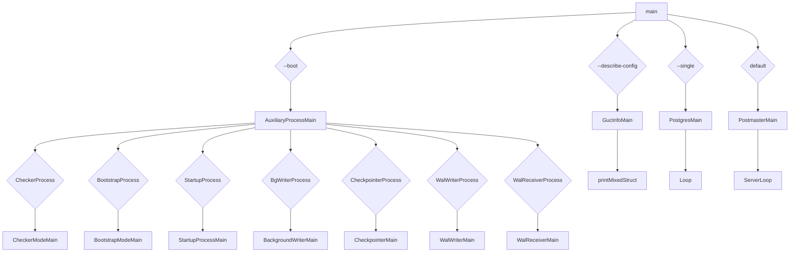

**这里的流程图，是入口调用的流程，入口的main函数，会根据不同的入参，走不同的分支流程。**

 - 这里default分支，是后面要介绍的流程，也是GP侦听网络连接，处理SQL的主要逻辑。


PostgresMain源码路径：**src\backend\tcop\postgres.c**


**PostgresMain的调用链：**


**PostgresMain说明：**
 * PostgresMain
 * postgres main loop -- all backends, interactive or otherwise start here
 * argc/argv are the command line arguments to be used.  (When being forked
  by the postmaster, these are not the original argv array of the process.)
 * dbname is the name of the database to connect to, or NULL if the database
  name should be extracted from the command line arguments or defaulted.
 * username is the PostgreSQL user name to be used for the session.
 ----------------------------------------------------------------

```c
/*
 * Main idle loop of postmaster
 *
 * NB: Needs to be called with signals blocked
 */
static int
ServerLoop(void)
{
	...
	for (;;)
	{
		...
		{
			...
			selres = select(nSockets, &rmask, NULL, NULL, &timeout);
			...
		}
		if (selres > 0)
		{
						int			i;

			for (i = 0; i < MAXLISTEN; i++)
			{
				if (ListenSocket[i] == PGINVALID_SOCKET)
					break;
				if (FD_ISSET(ListenSocket[i], &rmask))
				{
					Port	   *port;

					port = ConnCreate(ListenSocket[i]);
					if (port)
					{
						BackendStartup(port);

						/*
						 * We no longer need the open socket or port structure
						 * in this process
						 */
						StreamClose(port->sock);
						ConnFree(port);
					}
				}
			}
		}
	}
}
所在文件：src/backend/postmaster/postmaster.c
```
	上面的逻辑，是服务器端（QD&&QE）的网络侦听的进程，每来一个新的SQL，都会生成一个新的QD进程，和若干个QE进程，这些进程的入口，都是**PostgresMain**
```c
/*
 * BackendStartup -- start backend process
 *
 * returns: STATUS_ERROR if the fork failed, STATUS_OK otherwise.
 *
 * Note: if you change this code, also consider StartAutovacuumWorker.
 */
static int
BackendStartup(Port *port) {
	......
	pid = fork_process();
	if (pid == 0)				/* child */
	{
		IsUnderPostmaster = true;	/* we are a postmaster subprocess now */
		......
		/* And run the backend */
		BackendRun(port);
	}
}
所在文件：src/backend/postmaster/postmaster.c
```
	1：设置  IsUnderPostmaster = true; 表示当前是QD或者QE进程。
	2：会fork一个子进程，并执行**BackendRun**，这个函数，会再调用**PostgresMain**。
## QD角色设置
 **- GUC配置管理**
 1. GUC定义：Grand Unified Configuration，所有参数名称都不区分大小写。每个参数的值均为五种类型之一：布尔值，整数，浮点数，字符串或枚举。
 2. GUC分类：
```c
	enum config_type
	{
		PGC_BOOL,
		PGC_INT,
		PGC_REAL,
		PGC_STRING,
		PGC_ENUM
	};
```
		GUC中有五类变量设置，其中，DQ，DE的角色管理，是PGC_STRING，也就是字符串类型
```c
		struct config_string
		{
			struct config_generic gen;
			/* constant fields, must be set correctly in initial value: */
			char	  **variable;
			const char *boot_val;
			GucStringCheckHook check_hook;
			GucStringAssignHook assign_hook;
			GucShowHook show_hook;
			/* variable fields, initialized at runtime: */
			char	   *reset_val;
			void	   *reset_extra;
		};
```
		这里有几个关键的成员：
			1：check_hook，对相应配置做合法性检查的函数
			2：assign_hook，对相应变量赋值的函数
			3：show_hook，显示变量的函数
			4：boot_val，工程启动，变量的初始值
			
 3. GUC配置来源和时机：
```c
	typedef enum
	{
		PGC_INTERNAL,
		PGC_POSTMASTER,
		PGC_SIGHUP,
		PGC_BACKEND,
		PGC_SUSET,
		PGC_USERSET
	} GucContext;
```
		GUC选项只能在某些时间设置。规则是这样：
			 1. 用户根本无法设置INTERNAL选项，只能通过内部进程（“ server_version”是一个示例）。
			 2. POSTMASTER选项只能在postmaster（postmaster starts）启动时，从配置文件或命令行设置。
			 3. SIGHUP选项只能在Postmaster（postmaster startup）启动或在更改配置文件并将HUP信号发送到postmaster或后端进程时设置。 （请注意，signal 的处理函数不会在收到事件时立即对设置赋值，postmaster和后端在他们的主循环中的某个点对设置进行检查。）
			 4. BACKEND选项只能在postmaster（postmaster startup）启动时从配置文件，或根据客户端请求在连接启动时数据包（例如，来自libpq的PGOPTIONS变量）得到要设置的内容。此外，已经启动的后端将忽略对配置文件的更改。这意味着这些选项在后端启动后，值就是固定的。但它们在后端可以有不同的值。
			 5. SUSET选项可以在postmaster（postmaster startup）启动时通过SIGHUP进行设置机制，如果您是超级用户，可以通过SQL进行设置。
			 6. USERSET选项可以由任何人随时设置。

## QD初始化

 **角色分类：**
```c
	typedef enum
	{
		GP_ROLE_UTILITY = 0,	/* Operating as a simple database engine */
		GP_ROLE_DISPATCH,		/* Operating as the parallel query dispatcher，master */
		GP_ROLE_EXECUTE,		/* Operating as a parallel query executor ，segment */
		GP_ROLE_UNDEFINED		/* Should never see this role in use */
	} GpRoleValue;
```
		GP_ROLE_DISPATCH：master
		GP_ROLE_EXECUTE：segment
**QD初始化：**
全局角色变量：

```c
	GpRoleValue Gp_role;			/* Role paid by this Greenplum Database* backend */
	char	   *gp_role_string;		/* Staging area for guc.c */
	GpRoleValue Gp_session_role;	/* Role paid by this Greenplum Database* backend */
	char	   *gp_session_role_string; /* Staging area for guc.c */
```
	
```c
struct config_string ConfigureNamesString_gp[] =
{
	...
	{
		{"gp_session_role", PGC_BACKEND, GP_WORKER_IDENTITY,
			gettext_noop("Reports the default role for the session."),
			gettext_noop("Valid values are DISPATCH, EXECUTE, and UTILITY."),
			GUC_NO_SHOW_ALL | GUC_NOT_IN_SAMPLE | GUC_DISALLOW_IN_FILE
		},
		&gp_session_role_string,
		"dispatch",
		check_gp_session_role, assign_gp_session_role, show_gp_session_role
	},

	{
		{"gp_role", PGC_SUSET, CLIENT_CONN_OTHER,
			gettext_noop("Sets the role for the session."),
			gettext_noop("Valid values are DISPATCH, EXECUTE, and UTILITY."),
			GUC_NOT_IN_SAMPLE | GUC_DISALLOW_IN_FILE
		},
		&gp_role_string,
		"dispatch",
		NULL, assign_gp_role, show_gp_role
	},
	...
}
```
	上面的boot_val，被设置为"dispatch"，"dispatch"会被转换为 GP_ROLE_DISPATCH
```c
	/*
	 * Convert a Greenplum Database role string (as for gp_session_role or gp_role) to an
	 * enum value of type GpRoleValue. Return GP_ROLE_UNDEFINED in case the
	 * string is unrecognized.
	 */
	static GpRoleValue
	string_to_role(const char *string)
	{
		GpRoleValue role = GP_ROLE_UNDEFINED;
	
		if (pg_strcasecmp(string, "dispatch") == 0 || pg_strcasecmp(string, "") == 0)
		{
			role = GP_ROLE_DISPATCH;
		}
		else if (pg_strcasecmp(string, "execute") == 0)
		{
			role = GP_ROLE_EXECUTE;
		}
		else if (pg_strcasecmp(string, "utility") == 0)
		{
			role = GP_ROLE_UTILITY;
		}
	
		return role;
	}
```
**QD初始化调用链：**

**QD初始化逻辑：**
```c
	/*
	 * Initialize one GUC option variable to its compiled-in default.
	 *
	 * Note: the reason for calling check_hooks is not that we think the boot_val
	 * might fail, but that the hooks might wish to compute an "extra" struct.
	 */
	static void
	InitializeOneGUCOption(struct config_generic * gconf)
	{
		...
		case PGC_STRING:
			{
				struct config_string *conf = (struct config_string *) gconf;
				char	   *newval;
				void	   *extra = NULL;

				/* non-NULL boot_val must always get strdup'd */
				if (conf->boot_val != NULL)
					newval = guc_strdup(FATAL, conf->boot_val);
				else
					newval = NULL;

				if (!call_string_check_hook(conf, &newval, &extra,
											PGC_S_DEFAULT, LOG))
					elog(FATAL, "failed to initialize %s to \"%s\"",
						 conf->gen.name, newval ? newval : "");
				if (conf->assign_hook)
					(*conf->assign_hook) (newval, extra);
				*conf->variable = conf->reset_val = newval;
				conf->gen.extra = conf->reset_extra = extra;
				break;
			}
		...
	}
```
		这里的 conf->assign_hook，对应的就是assign_gp_role，这里的逻辑，把相应元素中的 boot_val，这里对应的是dispatch，转化为 GP_ROLE_DISPATCH，赋值给了Gp_role，可以看到，每个Postgres的启动配置过程，Gp_role的默认值就是 GP_ROLE_DISPATCH。到这里，QD角色的初始化逻辑就整理完了。
